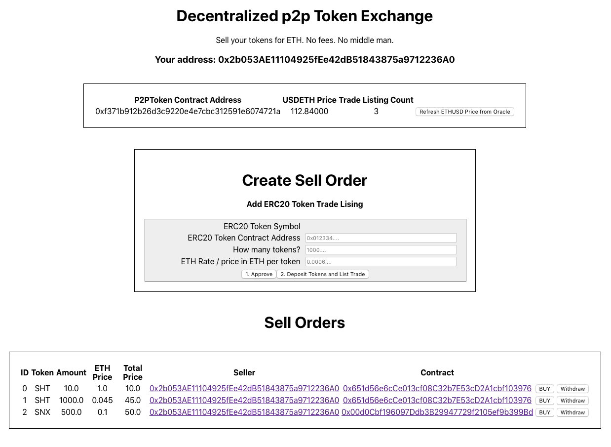
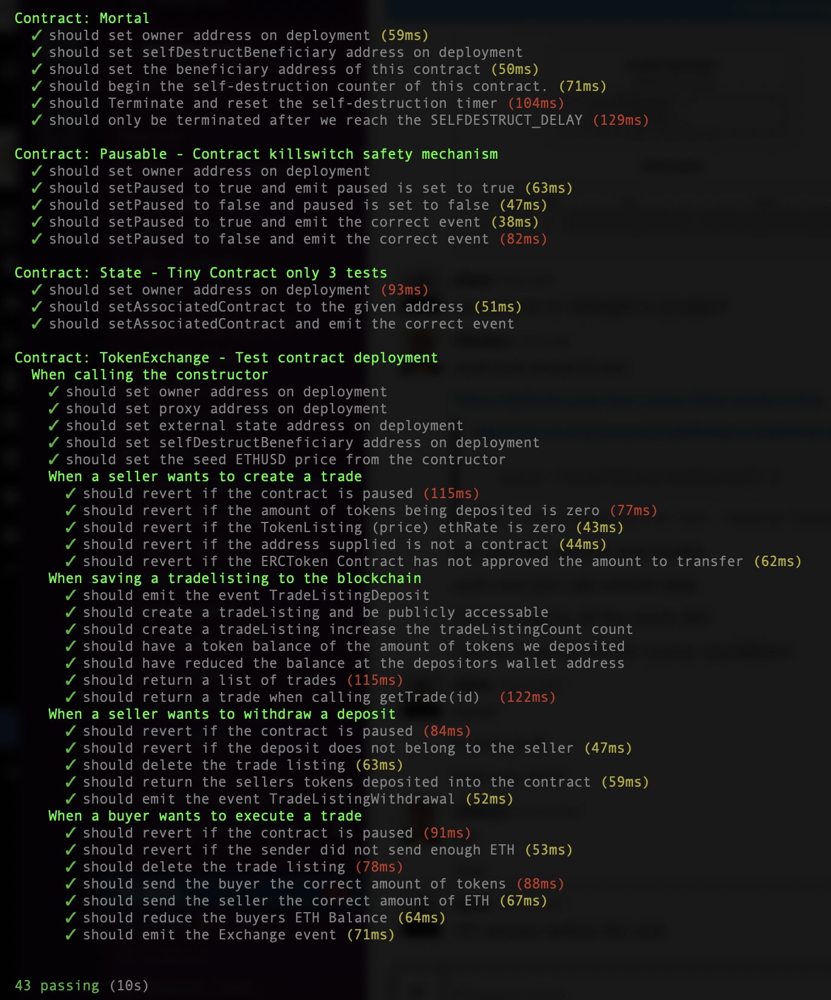
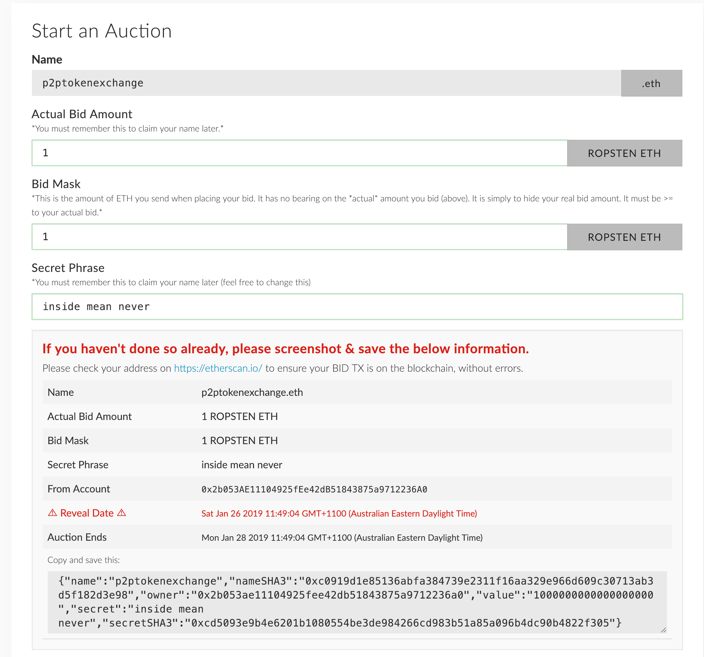

# P2P Token Exchange

A simple Peer 2 Peer Token exchange where;

- sellers create a trade listing, depositing their ERC20 tokens to trade into the contract.
- buyers pay ETH for the tokens and both actors are paid their coins.

This project focuses on the best patterns and practices implementation from the Consensys academy bootcamp. A lot of focus of the solution is the incorporation of important ethereum design patterns, protection mechanisms and the stretch goals that would be used in a real world decentralized solution. The project evaluation checklist provided below lists the completed tasks.

## User Journey

- Navigate to the REACT Dapp on IPFS https://ipfs.io/ipfs/Qmb.....
- See a list of available trades or
- Create a trade listing and deposit your ERC20 Tokens escrowed in the contract
- Buyers can select a trade to fulfil and send ETH to the contract and will be send your tokens, you will be sent the ETH
- Withdraw your trade listing and have your tokens returned to you



## Setup

Requirements:

- Truffle
- Node Package Manager (npm)
- Ganache CLI
- MetaMask

## Steps:

## Run Tests

0. Clone the repo
1. Install all the dependencies for the Truffle environment (Zeppelin library, ethers.js for the tests...etc).
   ```
   $ npm install
   ```
1. Start a local blockchain with Ganache. Make sure it is set on port 8545.
   ```
   $ ganache-cli -p 8545
   ```
1. Run `truffle test`

You should see



# Run the DAPP

Steps:

1. Go the `client` directory and install all the app dependencies.
   ```
   $ cd client
   $ npm install
   ```
2. As this app is using ether.js the `Contract` constructor will need the contract address. You will need to update the address in `App.js`.
   ```
   const SMART_CONTRACT_ADDR_ROPSTEN = "0xf371b912b26d3c9220e4e7cbc312591e6074721a";
   const SMART_CONTRACT_ADDR_LOCAL = "";
   const SMART_CONTRACT_ENS = "p2ptokenexchange.eth";
   // Set this const to your chosen ENV
   const SMART_CONTRACT_ADDR = SMART_CONTRACT_ADDR_ROPSTEN;
   ```
3. Start the React app.
   ```
   \$ npm run start
   ```
4. Alternatively you can use the app locally with the deployed contracts addresses:

Ropsten:

- TokenExchange: https://ropsten.etherscan.io/address/0xF371b912B26d3c9220e4e7cbC312591E6074721A
- TokenExchange ABI https://gist.github.com/hav-noms/4da6852c9656e10217cfda83f998bdd3
- Proxy: https://ropsten.etherscan.io/address/0x5f05f53A0E3E19A0de45b0Ac85100e3e61aE7EE4
- ShartCoin: https://ropsten.etherscan.io/token/0x651d56e6cCe013cf08C32b7E53cD2A1cbf103976
- TokenExchangeState: https://ropsten.etherscan.io/address/0xF371b912B26d3c9220e4e7cbC312591E6074721A

Rinkeby:

- https://rinkeby.etherscan.io/token/0x

## Deployed versions of the dApp

Ropsten: https://p2ptokenexchange-ropsten.netlify.com

To test the ROPSTEN connected DAPP you can buy the existing SHT coin tokens for ROPSTEN ETH and then sell them back to the exchange to create a listing. Or send any ERC20 on ROPSTEN to create a listing. Or ping me and I'll send you some SHT.

IPFS: https://ipfs.io/ipfs/QmdN5yNM4n35buFGN64EKpYgqVxUrX17i8CKxuL5NdTdYY

## Developer Bootcamp Final Project Evaluation Checklist

- [x] A README.md that explains the project
- [x] What does it do?
- [x] How to set it up.
- [x] How to run a local development server.
- [x] It should be a [Truffle project](https://truffleframework.com/docs/truffle/getting-started/creating-a-project).
- [x] All contracts should be in a `contracts` directory.
- [x] `truffle compile` should successfully compile contracts.
- [x] Migration contract and migration scripts should work.
- [x] `truffle migrate` should successfully migrate contracts to a locally running `ganache-cli` test blockchain on port `8454`.
- [x] All tests should be in a `tests` directory.
- [x] `truffle test` should migrate contracts and run the tests.
- [x] Smart contract code should be commented according to the [specs in the documentation](https://solidity.readthedocs.io/en/v0.5.2/layout-of-source-files.html#comments).
- [x] Create at least 5 tests for each smart contract.
- [x] Write a sentence or two explaining what the tests are covering, and explain why those tests were written.
- [x] A development server to serve the front-end interface of the application.
- [x] A document [design_pattern_decisions.md](design_pattern_decisions.md) that explains the design patterns chosen.
- [x] A document [avoiding_common_attacks.md](avoiding_common_attacks.md) that explains what measures were taken to ensure that the contracts are not susceptible to common attacks.
- [x] Implement/use a library or an EthPM package.

## Project Requirements

### User Interface

- [x] Run the dapp on a development server locally for testing and grading.
  - [x] Testing on Ropsten; (I chose ropsten instead of rinkeby becuase there is no ENS on rinkeby)
- [x] You should be able to visit a URL (can be localhost) and interact with the application
  - [x] localhost
  - [x] https://p2ptokenexchange-ropsten.netlify.com
- [x] Display the current account;
- [x] Sign transactions using MetaMask;
- [x] Reflect updates to the contract state

### Testing

- [x] Write 5 tests for each contract you wrote in Javascript;
- [x] Tests are properly structured (ie sets up context, executes a call on the function to be tested, and verifies the result is correct)
- [x] Explain why you wrote those tests in code comments;
- [x] Tests provide adequate coverage for the contracts
- [x] All Tests pass with `truffle test`.

### Design Patterns

- [x] Implement a circuit breaker (emergency stop) pattern.
- [x] What other design patterns have you used / not used?
  - [x] Why did you choose the patterns that you did?

### Security Tools / Common Attacks

- [x] Explain what measures you have taken to ensure that your contracts are not susceptible to common attacks.

### Use a Library or Extend a Contract

- [x] At least one of the project contracts includes an import from a library/contract or an ethPM package.

### Deployment

- [x] Deploy your application onto one of the test networks.
- [x] Include a document called [deployed_addresses.txt](deployed_addresses.txt) that describes where your contracts live (which testnet and address).
- [x] Students can verify their source code using Etherscan https://etherscan.io/verifyContract for the appropriate testnet.
- [x] Evaluators can check by getting the provided contract ABI and calling a function on the deployed contract at https://www.myetherwallet.com/#contracts or checking the verification on Etherscan.
- [x] Serve the UI from IPFS or a traditional web server
  - [x] https://p2ptokenexchange-ropsten.netlify.com

### Additional

- [x] Smart Contract code should be commented according to the specs in the documentation https://solidity.readthedocs.io/en/v0.4.21/layout-of-source-files.html#comments"

### Stretch

- [x] Implement an upgradable design pattern
  - [x] implemented proxy and external storage pattern
- [x] Oracle
  - [x] Implemented Oracalize for ETHUSD pricing
- [x] IPFS - users can dynamically upload documents to IPFS that are referenced via their smart contract.
  - [x] Add DAPP to IPFS https://ipfs.io/ipfs/QmdN5yNM4n35buFGN64EKpYgqVxUrX17i8CKxuL5NdTdYY
        added QmWM6ARdaeaj4VywUkYqAheHZAJgJ3WThHHQB5yP8wt8Hj build/asset-manifest.json
        added QmcFc6EPhavNSfdjG8byaxxV6KtHZvnDwYXLHvyJQPp3uN build/favicon.ico
        added QmdN5yNM4n35buFGN64EKpYgqVxUrX17i8CKxuL5NdTdYY build/index.html
        added QmfKqCqGsesAk1JhovJCQajk8awxuqjDPc8QnHa39oDx6g build/manifest.json
        added QmXJph8qat5t2mujeDkm4icdDx5cTnsNo37pwDh78myPFX build/precache-manifest.6858d106b39db0935e08f7d8b5d3cf31.js
        added QmYtCnhaenmZPzM3QAyCvkVWxyyonEx2WmqSuxZwsWcWaq build/service-worker.js
        added QmSt4HmAP8H7z8jY7Ydf2PeogMNm14VENGLaXQSDxsmMZN build/static/css/main.f5d2a5b6.chunk.css
        added QmQYh4kdU8Ctxaib7f7MTYGrsWcmTJfj9RvhkideTAVPzw build/static/css/main.f5d2a5b6.chunk.css.map
        added QmexaqtgBN1fUcoECoMbrGjbQU8v7jSEsWnj6MKwYbYgvB build/static/js/1.34cad1e0.chunk.js
        added QmXVBvearMWSfvw62B4etaFpGBx1cKX5pLLbLccgCwhtH2 build/static/js/1.34cad1e0.chunk.js.map
        added Qme9z3JjbFdfRpYNH84HxQukBn18GsRQNS9rE2se7ty9yc build/static/js/main.47c69635.chunk.js
        added QmeYTCfKi4Lv3fRrzNvre7wxz8iEztbcwfZ4CSgSZoPEb7 build/static/js/main.47c69635.chunk.js.map
        added QmXMf5jh5NJkmP77Cxisz7joqVdYCQq2YDnmYpUL2ZtCo5 build/static/js/runtime~main.229c360f.js
        added QmPdJpgMSyCN3WxjwxXC8ScjDeB2358Rj5odR49c1BpHvu build/static/js/runtime~main.229c360f.js.map
        added QmPphPgkWdFQF6NcAjXivW68UvUAL5Ui5UihKr2CvLjpKi build/static/css
        added Qmcy2C7TmmR1iaC2vWTttxQ2c87ZcnQuKAipGnzzE6WgeD build/static/js
        added QmQq7WdA9WVwUVkHUFAWoYEBRhugFm4dhXZ9tPYHvPzmZ8 build/static
        added QmYcq8taDY6FAxKYUji9SmTdYp6tzrCLuCNEzZuQnx4S4F build
- [x] Ethereum Name Service - a name registered on the ENS resolves to the contract, verifiable on `https://ropsten.etherscan.io/p2ptokenexchange.eth`
  - [x] ENS Auction created for p2ptokenexchange https://ropsten.etherscan.io/tx/0x96f6e371e123003a55069387732a51c85781ac5a33218fd9dcfdbdbc89b6e651


